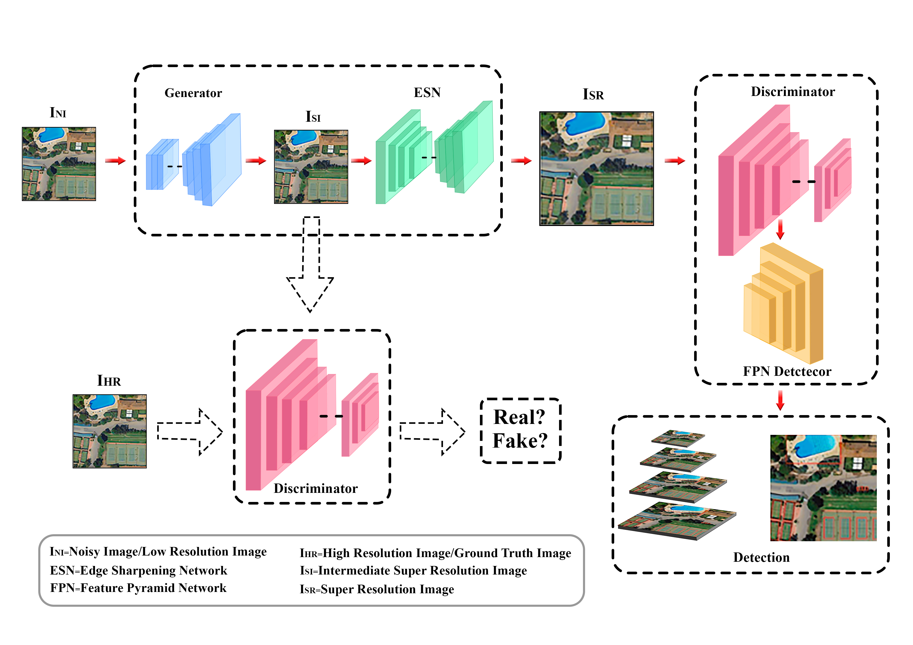

# FPGAN+ESN Model
## Model Architecture
</img>

## Dependencies and Installation
- Python 3 (Recommend to use Anaconda)
- PyTorch >= 1.0
- NVIDIA GPU + CUDA
- Python packages: `pip install -r path/to/requirement.txt`
## Training
`python train.py -c config_GAN.json`
## Testing
`python test.py -c config_GAN.json`
## Dataset Download links
1. **[DOTA Dataset](link-to-dota-dataset)** - DOTA dataset from here.

2. **[OGST Dataset](link-to-ogst-dataset)** - OGST dataset from here.

3. **[COWC Dataset](https://gdo152.llnl.gov/cowc/download/cowc-m/datasets/)** - COWC dataset from here.
[Here](https://github.com/LLNL/cowc/tree/master/COWC-M) is a GitHub repo to create custom image patches.

## Generate High, Low, and Bicubic Resolution Images For  Dataset
Download pre-made dataset of COWC from [here](https://gdo152.llnl.gov/cowc/download/cowc-m/datasets/DetectionPatches_256x256.tgz) and this script which is available in above scripts_for_datasets
/scripts_GAN_HR-LR.py  can be used with pre-made dataset to create high/low-resolution and bicubic images. Make sure to copy annotation files (.txt) in the HR, LR and Bic folder.  
## Configure JSON File

To get started, update the directory paths in the JSON file to match your local user environment. Pretrained weights can be downloaded from [Google Drive here](https://drive.google.com/drive/folders/15xN_TKKTUpQ5EVdZWJ2aZUa4Y-u-Mt0f?usp=sharing).

### Sample JSON Configuration

{
    "data_loader": {
        "type": "COWCGANFrcnnDataLoader",
        "args": {
            "data_dir_GT": "/your/local/path/to/HR_2/",
            "data_dir_LQ": "/your/local/path/to/LR_2/",
            "batch_size": 1,
            "shuffle": true,
            "validation_split": 0.0,
            "num_workers": 2
        }
    },
    "path": {
        "models": "/your/local/path/to/pretrained_models_FPGAN_ESN",
        "pretrain_model_G": "/your/local/path/to/20000_G1.pth",
        "pretrain_model_D": "/your/local/path/to/20000_D1.pth",
        "pretrain_model_FRCNN": "/your/local/path/to/20000_FRCNN1.pth",
        "data_dir_Valid": "/your/local/path/to/LR_2/",
        "Test_Result_SR": "/your/local/path/to/Results",
        "strict_load": false,
        "log": "saved/logs"
    },
    "logger": {
        "print_freq": 1,
        "save_checkpoint_freq": 20000
    }
}

### Contact Information 

For any assistance or questions regarding this code, feel free to reach out via email at usman.ahmad_scut@hotmail.com.

